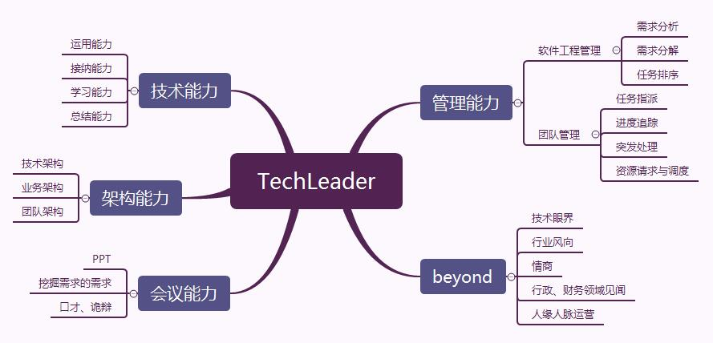

# 码农管码农 Collection<码农> Cookbook

## 0x00 写在前面

### 0.1 我~~渣渣灰~~又回来了

最近事情太多，变化也太多，拖了有半年了吧，儿子也都快半岁了。在居士威逼利诱之下，不得不重新灌水。

挂着架构师的title也有2年多了。印象中，架构师就是专心技术，对管理这种行政类工作基本不太过问。可是世事难料，当架构师还要带团队的时候，一些锅就光速飞到背后了。

因此在居士建议下，这里简单聊聊我怎么在锅山坑海中畅游，还能抽空摸鱼写文章的……经验？

### 0.2 简单来说

技术管理这块，的确很多人都想了解了解。自己还是基层码农的时候，也偶尔憧憬能上岸当管理。可真的技术负责人这个title安排到头上的时候，却发现真不是自己当初想象的那样。简直不要太惨好么！！！领导经常突击催进度，需求方突击改需求……项目推进的各种坑，以及坑里各种锅，最后还是自己默默填默默背。手下的小兄弟们，几乎全指着你过日子：不光要处理进度安排跟踪、解决疑惑这种日常，还要安抚情绪，嘘寒问暖。这哪是领导，分明是保姆好么！

~~天啊，放我回去搬砖吧！~~

既来之，则安之。带带团队也是很有收获的。项目进度一步步成功推进，整个团队共同进步，稍微落后的成员开始加速追赶……每项成就感都是自己一点一滴努力浇灌的。

本文会简单聊到我对组员工作定位和任务安排的一些小技巧，以及和上下级相处的一些小套路。同之前求职那篇一样，尽量轻松愉快的文笔描述，尽量不变成鸡汤~~（还是注水的那种）~~

下面就来聊聊如何cook TeachTeam这个Collection

## 0x01 myTeam = new TechTeam()

myTeam.setLeader(Link)

新项目来了，被钦定为技术负责人，创建团队推动项目。一个TeachTeam被new出来了。

来看看这个集合的各种操作，底层实现到底是怎么样的吧~

### 1.1 myTeam.add(programmer1)

开团当然要先捞人。第一第二梯队的巨佬们，谁都想请到组里来；要是挖不动挖不够，放HC社招！过程不表

新组员进组，当Leader的自然要先套路一下熟悉一下，对成员能力有个大致认知。

分享一下我评估组员能力的5个维度：

```

Research 研究能力

指接收新事物，探索未知，研究创新的能力。此项能力可有效划分CURD工程师和开发工程师。

Develop 开发能力

码农的核心能力，对开发框架、环境等等的熟悉程度和运用灵活度。

Operation 运维能力

指突发性能事件处理和预防能力。可以侧面反映成员对项目和环境的熟悉程度，以及未雨绸缪的能力。

Architecture 架构能力

不仅指软件架构，也指对项目和更高维度的大局观和细节观。

Management 管理能力

当团队大起来，就需要有人帮忙分摊管理任务了。

```

经过如上5个维度的评估，那大致对新组员进组后，工作划分就非常清晰。评估套路参考面试，只不过氛围会相对轻松点。

另外很重要一点就是人品。这个没法客观量化，只能在相处中慢慢感受了。

其他的例如带新组员认识团队，介绍项目啥的，都懂的，没啥好说。

### 1.2 myTeam.remove(programmerX)

成员的离开包括他主动离开，和被动请离。

成员要是主动离开，做Leader的真的要好好反省一下了。是自己行事和他不合拍，还是工作中有什么让他不爽，还是其他原因？

只要不是说人品问题，或触犯原则，其实很多时候成员主动退出还是可以避免的。毕竟丢人头这事太伤神了。项目推进受挫，或者需求方瞎改，或者家里出什么问题，都会影响成员在组里呆的意愿。**压死骆驼不是因为最后一根稻草**，实际上是积怨已久，某事件让其崩溃，将所有情绪一次性爆发出来。

那么Leader在平时跟组员相处沟通，就要非常注意了。瞎改需求能挡就挡，负担适当分摊，开小灶小团建啥的，自己懂的！

**当Leader很重要一点，是能承担责任**。我见识过太多甩锅大佬，甩锅的套路真的丰富，诚然没人愿意再在他的组里呆了。不光不甩锅，有些时候还要主动帮组员接。当然，一切都是在自己能力范围和承受范围之内。**控制组员和自己的工作压力**，也是Leader的哲学。

如果是真的要做丑人，请离呢？真的受不了了，只能送神仙了，怎么办呢？

尽量别得罪人吧。毕竟码农的圈子就这么大，保不齐跳槽跳到被你赶走的少年手下，那你就得好好回忆回忆曾经对人家做过啥了~~

### 1.3 myTeam.size()

从光杆司令一步步团队人头开始起来了，项目也开始蹒跚推进了。日复一日在跟需求和领导扯皮推锅，在各个会议中流窜装13，和成员嬉笑怒骂，缩在工位编段子一样写PPT的无聊日子里，Leader还要干些啥？

码农能被提拔为Leader，那他在某些技术领域造诣应该是高于组员的，技术指导甚至亲自下田务农少不了。诚然，授人以鱼不如授人以渔，经常组员请教就放下工作去帮忙不是长久之计；Leader首先是工程师，其次才是组长、主管。作为Leader，是要比组员**更加频繁的进行技术总结**。然后在合适的机会将总结分享，**提升团队的总体技术水平**。如果有人老是遇到坑就直接问，不会先自己独立分析问题，怎么办呢？好好重新评估他的R、D、O分，然后做出合理决定吧！

另外一个就是最可怕的瞎改需求了。吹水的能力也是Leader能力很重要的一环。把需求方吹晕然后把瞎改的需求挡掉，不就是为团队减负么？然后就是为团队争取业绩的吹水了。项目推得再好不如PPT写得好。关键手法就是避重就轻：谁项目没个坑，但是可以在汇报PPT上，把填坑美化成功绩，或者用其他功劳掩盖挖坑。具体怎么美化，自己琢磨嘞！就算没能怎么提升业绩，但是装13带来的虚荣感也是很能鼓舞士气的。

然后就是日常~~摸鱼~~了。士气不咋滴的时候，叫个外卖，搞一下下午茶、小零食啥的，花不了多少钱，但是很能哄人。平时处事也多少放下点架子，毕竟互联网行业提倡扁平化管理，上下级打成一片不是么？当然一点威严也是要有的，不然真指挥不动这帮家伙。简单来讲就是赏罚分明，心如明镜。鸡汤就不灌了。

### 1.4 myTeam.clear()

项目完成、被砍下马，或者Leader被抓到别处去搬砖或跳槽，要和团队分开了。Then what？

身在职场，人脉人缘这点不必多讲。好聚好散，以后有机会再度合作吧。去到新组或新公司，能不能请动以前共事的兄弟们，就看曾经相处的时候，Leader的造化了~

组织吃个散伙饭吧，借此机会把一些之前没能说出口的，都吐一吐。酒足饭饱，江湖再见

## 0x02 About Leader

下面总结一下我当Leader的一丢丢建议

### 2.1 TechLeader技能树



毕竟我当Leader的资历不如众大佬长，此树及其列举的并不完全，仅供参考~

### 2.2 抗压、抗压、抗压

带团队，推项目是很累的。**管理工作，就是如何合理将压力分摊到团队上**；不让团队里任何人崩溃，则考量Leader的管理微操了。而大多数压力，都会压在Leader头上，因此想“上岸”的小伙伴们，被安排加班就叫苦不迭吗？Too young！

Leader不光要会分锅，还要懂得鼓舞士气。鼓舞大家，同时也骗骗自己吧~

### 2.3 沟通、沟通、沟通

熟悉和信任的前提都是沟通。除了刚进组时套路能力的沟通，在平时也要多套路一下。**尽量不过多侵占工作和私人时间，以轻松的形式沟通**，而不是动不动开会那种。了解清楚组员近况、工作进度、烦心事。就算不能帮忙，做个倾听者，也是很鼓舞人的。

### 2.4 PPT是最好的语言

开会做汇报总少不了PPT。PPT是总结的浓缩，是功绩的载体。多搞几套高大上的模板，练练文案，陈述上避重就轻，把满身苍夷的项目包装成人人追捧的女神~ ~~KPI OKR哗哗来~~

## 0x03 瞎扯一下

最近抱娃了，回看一直带团队的经历，真心觉得两者太像了。项目推进过程总能给我带来惊喜，突如其来、震感强烈、措手不及、没法回避。

带团队的，团队和项目就是自己的孩子。像奶爸一样细心认真去浇灌每一项事务，总有收获的一天（吧）