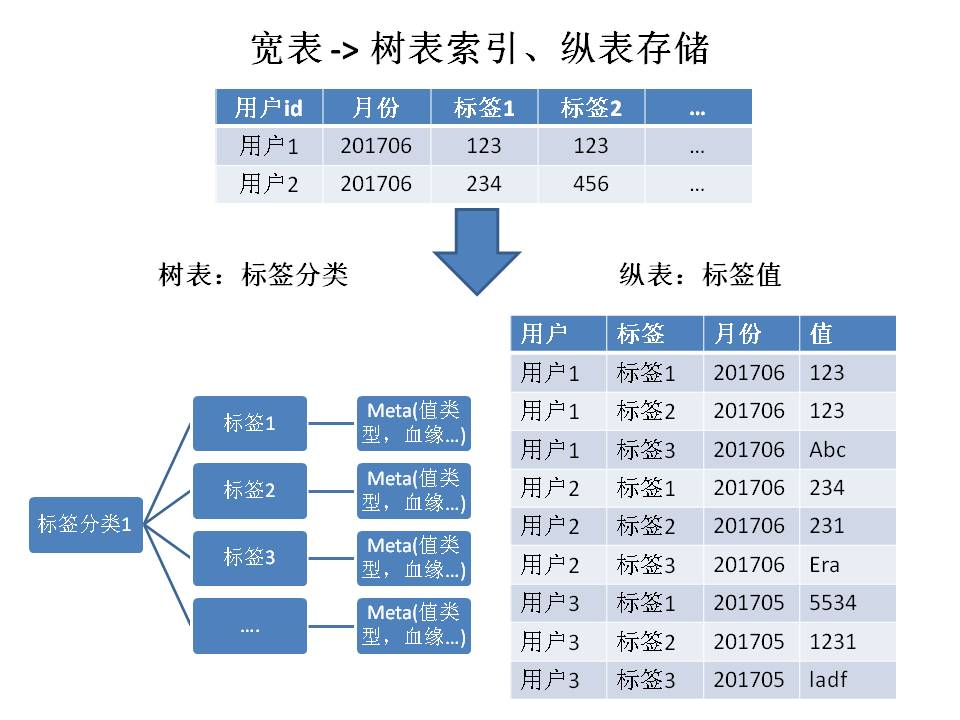

# 稀疏与绵密，HBase动态列or固定列？

用户画像技术实现长篇连载

## 0 写在前面

### 0.1 长篇连载第一坑

上次写了俩篇职场文，虽说被多位大佬翻牌子，相当exciting。但自己还是比较喜欢总结下技术。职场心得感觉写不出什么干货出来。。。

以前的技术总结，都是在群里讨论的过程中，在大概细节都描述完了，总体来个概括，或者直接PPT截图胡脸。其中丢失了不少细节，总体也不够结构化。

所以感觉要开个长篇连载，来描述讨论过的技术问题。

这里就拿经常被讨论的用户画像，来开我写技术总结的新天坑~

### 0.2 用户画像

在上家给电信运营商开发过用户画像项目。虽说和互联网大厂实际应用的用户画像，形式上有所出入，但是核心理念还是能互通的。这里只讨论该项目中的场景：标签数据是离线开发成宽表的。应用场景只有2个，面向单用户查询的数据应用，和面向标签属性筛用户清单的OLAP分析。

话不多说，言归正传：

## 1 比技术专家的头发还稀疏的宽表

###### #你感受到力量了吗（图文无关）

画像标签数据为啥会稀疏呢？首先我们得看标签数据是什么，怎么来的。

**画像标签本质就是基于用户的业务行为，总结出的一系列结论性数据。**

因此性别，年龄这种，不属于画像标签，应该叫用户属性。

那么问题来了。每个用户，其产生的业务行为，并不会覆盖所有的业务模块。而我们的标签数据，又是由各业务模块产生的业务数据，从ODS一路生产下来。

用户行为没覆盖到的业务模块，对应标签没有就是没有了咯……

真的没有了吗？

### 1.1 数据质量的锅

画像标签毕竟是属于数据开发中的下游，其质量非常依赖于上游每个链条环节。例如数据来源异常丰富的场景，对应的ETL处理逻辑和清洗口径，也是比较复杂。在这个环节某些干净的数据被当做脏数据清理，也是有可能的。

### 1.2 数据治理的锅

丢数据？至少一次和精确一次语义？

### 1.3 没锅可甩了

好吧它就是这么稀疏，你能怎么办？

## 2 面向应用

### 2.1 Why HBase

HBase是什么，我这里就不多费口舌了。没见识过的戳[Apache HBaase](https://hbase.apache.org)了解~~，这是你没有玩过的船新版本~~

简单来讲，HBase是能轻松抗住千亿级别数据，高可用、持久化、带一定结构、支持key简单模糊查询的HashMap。

### 2.2 How HBase

因为HBase本身存储的表结构信息非常有限，因此要想HBase好用，我们得将一些表的元数据信息通过别的方式进行存储。

对于存储而言，紧凑是提升性能很关键的因素。可以参考MySQL中，如果一表有贼多text/varchar字段的话，都建议把这些字段拆开到另一张拓展表上。

那如何在HBase中将稀疏宽表实现紧凑呢？

我们这里采用的是行表拆分为结构化meta和kv纵表。

其中，树表（标签分类-标签meta）通过关系型数据库存储。

一张画像宽表就是一个标签分类，宽表下面的维度/度量则基本就是标签。

后续是根据此树驱动将宽表数据bulkload到HBase中。

可以发现，这样设计的画像存储，宽表中缺失的cell，不会写入到HBase row中，因此可实现关系型数据库+HBase的双紧凑。

### 2.3 HBase存储简述

### 2.4 表结构设计

HBase应用的重中之重，就是行键设计

#### 2.4.1 有序行键

自增ID喜欢吗，对不起，不许胡闹。

#### 2.4.2 隐式有序（半有序）行键

又想自增，又想离散，~~你喜欢就好~~业务需求为重啊。

在用户画像里，时序是我们的好盆友

#### 2.4.3 UUID离散行键

和有序行键其实差不多，其作用是完全丢弃行键扫描的特性，仅仅只是起到标识不同的行的作用。

但和有序自增相比，UUID基本能避免读取写入热点region问题，但是彻底把锅甩给外部二级索引，excuse me？

---

HBase行键设计，我简单总结几点建议：

**行键尽量等长，也就是固定n个字节**，建议不超过64bytes。因为HFile格式中，一个Cell存储上是一行keyValue，太长的行键非常消耗空间

**行键应自带高频查询场景通用的过滤性字段信息**，根据过滤规则进行编排，最后通过分隔符拼接。同MySQL等关系型数据库的索引设计，加入行键中的字段，过滤性要足够强（类似性别这种维度基数太小的就滚蛋吧）

设计好行键规则先脑补或测试出行键基本分布，**避免热点region问题**

拼装行键的分隔符，可以使用不可打印字符，避免和字段值冲突。例如[ASCII控制字符](https://baike.baidu.com/item/%E6%8E%A7%E5%88%B6%E5%AD%97%E7%AC%A6/6913704?fr=aladdin)

### 2.5 列族划分

疯狂的store装载，卸载。RegionServer表示感谢你全家。

列族应视为关系型数据库的拓展表。列族划分要充分考虑全局业务逻辑。

### 2.6 分工合作

关系型和非关系型数据库，不是欢喜冤家，而是互相补充。

## 3 后面再说吧

技术总结要是和又臭又长的简历一样hard to read，你们就弃番了。另外卖卖关子，你们才不那么容易抛弃我 T^T

