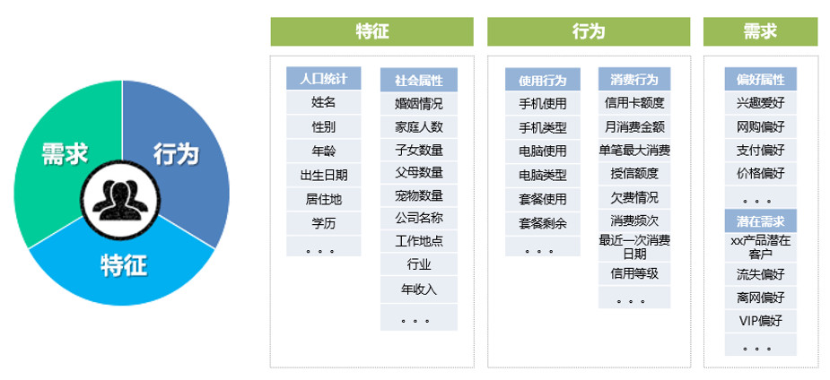

# 用户画像

## 0x00 写在前面

### 0.1 长篇连载第一坑

上次写了俩篇职场文，虽说被多位大佬翻牌子，相当exciting。但自己还是比较喜欢总结下技术。职场心得感觉写不出什么干货出来。。。

以前的技术总结，都是在群里讨论的过程中，在大概细节都描述完了，总体来个概括，或者直接PPT截图胡脸。其中丢失了不少细节，总体也不够结构化。

所以感觉要开个长篇连载，来描述讨论过的技术问题。

这里就拿经常被讨论的用户画像，来开我写技术总结的新天坑~

### 0.2 用户画像

在典型的数仓和BI开发中，我们总会围绕用户维度，构建各种指标和报表。例如面向大盘的用户UVPV留存、垂直针对业务板块的用户使用行为统计分析，用户分组分群等等。通过一系列宽表和清单，我们围绕每个用户，构建了一系列的指标和标签。这些数据，可以统称为用户画像。



当后续业务例如营销、推荐、风控等场景，需要集中使用用户的特定标签，那么，在数仓中以宽表形式存储的数据就变得难以使用了。

如何合理组织生产画像标签，并高效存储以供应用快速查询，则是本系列文章希望探讨的内容。

本系列计划分4篇文章

```
第一篇 即本篇，简单探讨用户画像的前世今生
第二篇 探讨用户画像的标签体系
第三篇 探讨如何驱动生产和合理存储画像标签
第四篇 探讨用户画像的应用场景
```

## 0x01 从数据体系开始

### 1.1 从运营数据分析构建画像标签

公司业务发展到一定规模，领导们觉得需要数据加持了，组件数据团队，构建数据平台，开始围绕产品运营的数据进行各种统计分析。

经验丰富的数据团队，会根据业务方的数据需求和各种数仓建模理论，构建一系列业务数据模型，设计各种通用宽表，以适应天天在变的分析报表需求


当中间的通用宽表沉淀到一定程度的时候，能基于用户的统计指标，粗略的描绘每个用户的行为了。

### 1.2 从临时提数构建画像标签

业务方经常会有各种奇思妙想，希望根据某些条件筛选出一系列用户清单。典型的例如某些营销活动的准入用户清单。这是提数中很常见的场景。

像我们过去的做法，每次业务方提出拉用户清单类的临时提数需求，会找机会统一固化为标签表的形式。然后通过标签表筛用户清单，提供给业务方。


标签表一定要注意关联性，业务上相关联的标签，就整到一张表中集中维护。

这种动态增加列的表，可以不存在hive等数仓，介质自定，可以是HBase、Cassandra等列式数据库。

